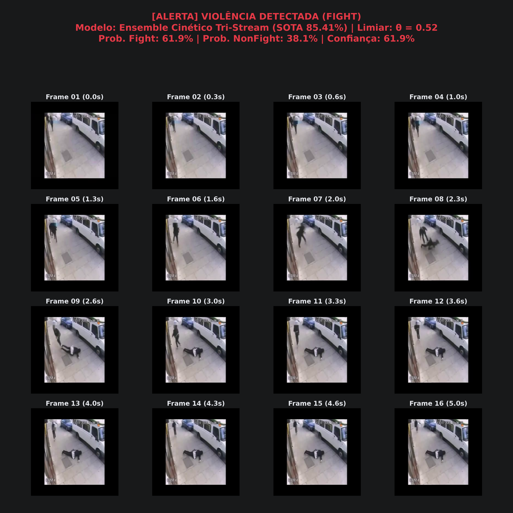
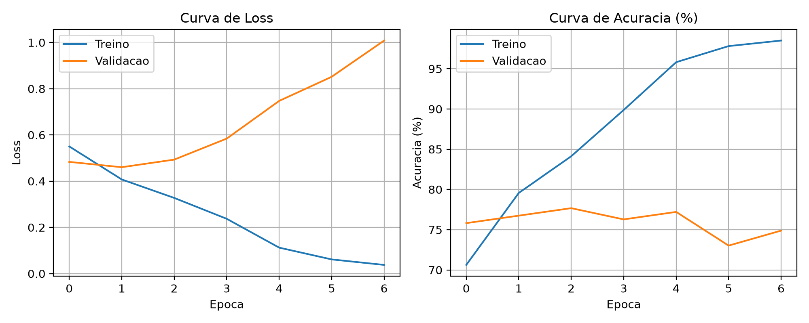
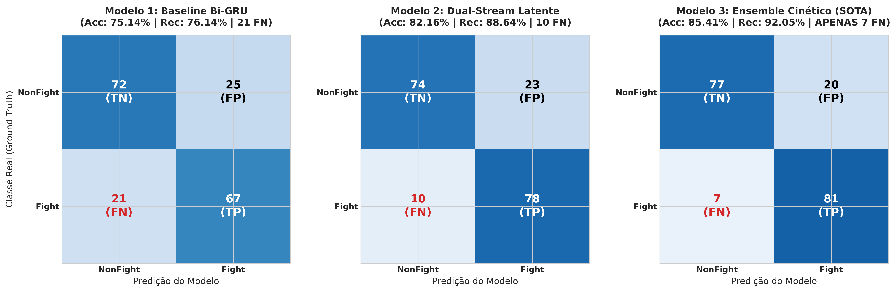
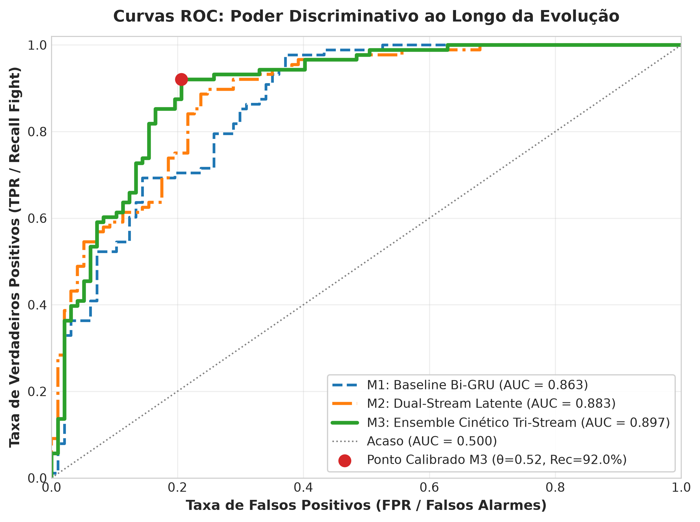
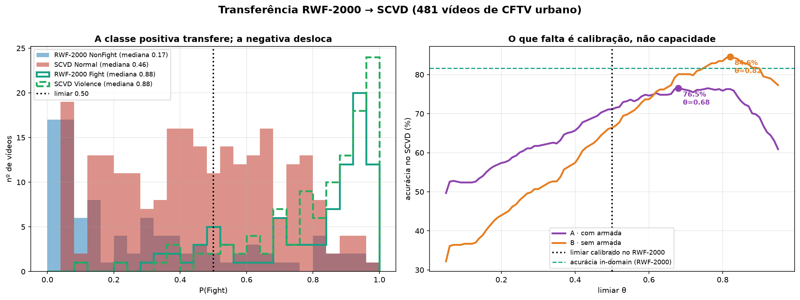

# Surveillance Video Classifier: Detecção de Violência em CCTV (Edge AI)

[](https://www.python.org/)
[](https://pytorch.org/)
[](https://onnxruntime.ai/)
[-81.62%25-brightgreen.svg)]()
[]()
[](LICENSE)

Classificação de vídeos de vigilância para detecção de agressão física em câmeras estáticas de CFTV, com inferência em CPU. A diretriz de engenharia é a assimetria de custo entre os erros: um falso positivo custa segundos de atenção de um vigilante; um falso negativo é uma agressão que ninguém viu.

**Semente, membros do ensemble e limiar são escolhidos exclusivamente sobre a validação. O teste entra apenas na avaliação final, depois de todas as decisões de modelagem.**

---

## Resultados no teste cego

185 vídeos de câmeras inéditas (88 `Fight`, 97 `NonFight`), os três modelos sob protocolo idêntico e limiar 0,50:

| Métrica | Modelo 1: Baseline | Modelo 2: Dual-Stream | Modelo 3: Ensemble |
| :--- | :---: | :---: | :---: |
| **Acurácia** | 76.22% | 78.38% | **81.62%** |
| **Recall** (Fight) | 71.59% | **90.91%** | 85.23% |
| **Precisão** (Fight) | 76.83% | 71.43% | **78.12%** |
| **F1-Score** | 74.12% | 80.00% | **81.52%** |
| **AUC-ROC** | 85.63% | 89.26% | **89.60%** |
| Falsos negativos / positivos | 25 / 19 | **8** / 32 | 13 / 21 |
| Parâmetros | 1.17M | 1.44M | 2.86M |

O Modelo 2 perde menos agressões (8 FN) mas dispara 32 alarmes falsos. O Modelo 3 é o melhor equilíbrio e o maior AUC-ROC — a métrica que independe do limiar.

```bash
python src/evaluate.py --model ensemble
```

JSONs: [`baseline`](reports/test_metrics_baseline.json) · [`dualstream`](reports/test_metrics_dualstream.json) · [`ensemble`](reports/test_metrics_ensemble.json)

---

## Demonstração de inferência



| Vídeo | Origem | Real | Decisão | P(Fight) |
| :--- | :--- | :---: | :---: | :---: |
| [`sample_video.avi`](sample_video.avi) | RWF-2000, câmera inédita | `Fight` | Fight | 69.85% |
| [`sample_scvd_violence.avi`](sample_scvd_violence.avi) | **SCVD**, outro dataset | `Fight` | Fight | 98.86% |
| [`sample_scvd_normal.avi`](sample_scvd_normal.avi) | **SCVD**, outro dataset | `NonFight` | NonFight | 4.31% |

```bash
python src/inference.py --video sample_scvd_violence.avi --label Fight
```

Os dois clipes do SCVD vêm de um dataset independente, em 720p, que não participou de nenhuma etapa do treino — incluídos com atribuição à fonte (`Test/Violence/t_v007` e `Test/Normal/t_n037`). Não são casos representativos: a [seção 6](#6-validação-externa-outro-dataset) reporta o desempenho sobre os 481 vídeos.

---

## 1. Dataset e anti-leakage

**RWF-2000** — *Real World Fighting*, Cheng, Cai & Li (2020). 2.000 gravações reais de CFTV estático, 5 s a 30 FPS, balanceado.
Fonte: <https://github.com/mchengny/RWF2000-Video-Database-for-Violence-Detection> · espelho: <https://www.kaggle.com/datasets/vulamnguyen/rwf2000>

* **`Fight` (1)** — agressões físicas: socos, chutes, empurrões, confrontos corporais.
* **`NonFight` (0)** — monitoramento normal: caminhadas, conversas, aglomerações pacíficas, tráfego.

**A armadilha:** vários clipes vêm de cortes temporais do **mesmo vídeo original** — mesma câmera, fundo e iluminação. Um split aleatório faria o modelo memorizar cenários. [`src/create_splits.py`](src/create_splits.py) deriva o identificador do vídeo original do nome do arquivo e o usa como grupo no `GroupShuffleSplit`:

| Conjunto | Vídeos | Fight | NonFight | Grupos | Origem |
| :--- | :---: | :---: | :---: | :---: | :--- |
| Treinamento | 1.600 | 800 | 800 | 765 | Pasta oficial `train` |
| Validação | 215 | 112 | 103 | 90 | Pasta oficial `val`, metade |
| Teste cego | 185 | 88 | 97 | 90 | Pasta oficial `val`, outra metade |

A garantia é verificada, não declarada: `create_splits.py` falha se um grupo atravessar a fronteira, e `python tests/test_splits.py` confirma **0 grupos e 0 arquivos** em comum entre os três splits.

---

## 2. Pré-processamento

1. **16 quadros equidistantes** cobrindo os 5 s do clipe. Quadros vizinhos a 30 FPS carregam pouca informação nova; isso corta 89,3% do volume de dados.
2. **Decodificação seletiva** — `cv2.VideoCapture.grab()` avança o cursor sem decodificar, e `read()` só é chamado nos 16 instantes escolhidos.
3. **224×224, BGR→RGB, normalização ImageNet** (μ = [0.485, 0.456, 0.406], σ = [0.229, 0.224, 0.225]) — as mesmas estatísticas do pré-treino do backbone. O resize não preserva a proporção 4:3.
4. **Data augmentation** — flip horizontal idêntico nos 16 quadros do clipe.

**Cuidado que o backbone congelado exige:** como as features são extraídas uma vez e cacheadas, aplicar o flip nessa passada daria uma perturbação **fixa** por vídeo, igual em todas as épocas — ruído congelado, não augmentation. Por isso [`src/build_cache.py`](src/build_cache.py) materializa dois caches (original e espelhado) e o treino sorteia entre eles a cada época. Custo: o dobro de disco, zero de compute.

> Os resultados publicados foram treinados **sem** o cache espelhado, por indisponibilidade do dataset bruto no ambiente de retreinamento. O ganho do augmentation está implementado, mas não medido.

---

## 3. Os três modelos

Todas as arquiteturas vivem em [`src/model.py`](src/model.py), importadas por treino, benchmarks e avaliação.

**Modelo 1 — Baseline.** MobileNetV3-Small pré-treinado no ImageNet e **congelado** (576 dim) + Bi-GRU com pooling médio temporal. Congelar é deliberado: com câmeras fixas, o fine-tuning faz os filtros se especializarem na textura do fundo em vez do movimento — e é o que permite cachear features e treinar 80 modelos em minutos. Limitação estrutural: só enxerga aparência estática, então gesticulação vigorosa e agressão têm embeddings parecidos.

**Modelo 2 — Dual-Stream latente.** Duas Bi-GRUs paralelas: aparência (*f_t*) e velocidade (Δ*f_t* = *f_t* − *f_{t−1}*). Substitui o optical flow em pixels — centenas de ms por quadro — por uma subtração vetorial no espaço latente. O recall salta de 71,6% para 90,9%, ao custo de 32 falsos positivos.

**Modelo 3 — Ensemble cinético.** Comitê de 3 cabeças com média das probabilidades: uma TriStream (aparência + velocidade + aceleração Δ²*f_t*, com pooling Mean+Max) e duas DualStream Mean+Max de sementes distintas. O backbone roda **uma vez por vídeo** e as três cabeças custam 7,05 ms somadas. Artefatos em [`models/ensemble/`](models/ensemble/).

---

## 4. Validação estatística

Com 185 vídeos de teste, a variação entre sementes é da mesma ordem da diferença entre arquiteturas. Por isso a escolha do modelo olha uma distribuição, não um treinamento.

1. **Pool de candidatos** — 20 sementes por arquitetura, mesmas condições (early stopping por `val_loss` com paciência 5, `fight_weight = 1.35`, `AdamW`, `CosineAnnealingLR`). O teste não é consultado nesta etapa.
2. **Seleção na validação** — melhor candidato de cada arquitetura, e melhor trio no caso do ensemble, por F1 sobre os 215 vídeos.
3. **Teste avaliado uma vez**, com o que saiu da etapa anterior.

| Arquitetura | Candidatos | Acurácia na validação |
| :--- | :---: | :---: |
| Modelo 1: Baseline | 20 sementes | 73.28% ± 1.59 |
| Modelo 2: Dual-Stream | 20 sementes | 74.42% ± 1.90 |
| Modelo 3: Ensemble | 3.800 trios | **76.81% ± 1.09** |

O ensemble tem média mais alta **e** desvio menor — o efeito esperado de um comitê. Registros em [`selection_baseline`](reports/selection_baseline.json) · [`selection_dualstream`](reports/selection_dualstream.json) · [`ensemble_selection`](reports/ensemble_selection.json).

**Duas decisões de protocolo**, ambas tomadas a partir da validação:

* **O limiar fica fixo em 0,50 durante a seleção.** Escolher semente e limiar ao mesmo tempo em 215 vídeos superajusta a validação — uma varredura de 91 limiares elegeu θ = 0,15 para o dual-stream, que rendeu 67,5% de precisão no teste. Com o limiar fixo, a seleção mede a arquitetura; o ponto de operação vira decisão separada ([seção 8](#8-ponto-de-operação)).
* **O critério é F1, não recall sob precisão mínima.** A restrição `precisão ≥ 0,80` é inviável para o baseline: ele só a atinge a θ ≥ 0,71, onde o recall cai para 56%. Um critério que uma das arquiteturas não satisfaz não compara arquiteturas.

### Overfitting / underfitting



| Modelo | Semente | Melhor época | Épocas até parar | `val_loss` |
| :--- | :---: | :---: | :---: | :---: |
| [Baseline](reports/selected/training_curves_modelo1_baseline.png) | 1 | 5 | 10 | 0.5314 |
| [Dual-Stream](reports/selected/training_curves_modelo2_dualstream.png) | 12 | 2 | 7 | 0.5054 |
| [TriStream](reports/selected/training_curves_modelo3_tristream.png) | 17 | 2 | 7 | 0.4603 |

O padrão se repete nos três: a perda de treino cai enquanto a de validação para de melhorar cedo. O early stopping detecta e restaura o melhor checkpoint — a divergência é contida, não evitada. Modelos com mais capacidade atingem o mínimo mais cedo e com `val_loss` menor.

Mecanismos: transfer learning contra underfitting; backbone congelado, `Dropout(0.4)`, `weight_decay = 1e-4` e early stopping contra overfitting.

---

## 5. Matrizes de confusão, ROC e análise dos erros





### Onde o modelo erra

Contar 13 FN e 21 FP diz pouco. [`reports/error_analysis.py`](reports/error_analysis.py) responde o que muda a decisão de engenharia:

**Os falsos positivos são o problema, não os falsos negativos.** A margem mediana até o limiar é 17,3 p.p. nos erros contra 39,8 p.p. nos acertos — mas os FN ficam a 10,1 p.p. (agressões sutis, recuperáveis por calibração) e os FP a 30,2 p.p. Os cinco erros mais confiantes são todos falsos positivos, com P(Fight) entre 90% e 97%: o modelo está **confiantemente** errado, o que é falha de representação e não de limiar.

**Os erros se concentram em poucas câmeras.** Dos 90 grupos do teste, **71 (79%) não erram nada**; sete grupos concentram 22 dos 34 erros. Excluindo os três piores — 23 clipes de 185 — a acurácia sobe de 81,62% para **86,42%**. Cinco desses sete têm clipes das **duas classes na mesma câmera**: mesmo fundo, mesma luz, só o movimento muda. É o caso mais difícil possível, e é o que o split por grupo força de propósito.

**Nenhum limiar resolve.** A varredura mostra 0,50 já no ótimo de acurácia; mover só troca um tipo de erro pelo outro. Reduzir FN de 13 para 7 custa 7 FP a mais — decisão de política. Eliminar os FP confiantes exige mais dados dos cenários que os produzem.

Detalhes em [`reports/error_analysis.json`](reports/error_analysis.json).

---

## 6. Validação externa: outro dataset

Aplicar o modelo pronto, **sem retreinar**, a um dataset independente. Nenhum vídeo do SCVD participou do treino, da validação ou da seleção.

**SCVD** — *Smart-City CCTV Violence Detection*, 481 vídeos de CFTV urbano em 720p: `Normal` (246), `Violence` (111), `Weaponized` (124).
Fonte: <https://www.kaggle.com/datasets/toluwaniaremu/smartcity-cctv-violence-detection-dataset-scvd>

Como o classificador é binário, duas versões separam violência corporal de armada:

| Conjunto | Acurácia | Recall | Precisão | F1 | AUC-ROC |
| :--- | :---: | :---: | :---: | :---: | :---: |
| RWF-2000 (in-domain) | 81.62% | 85.23% | 78.12% | 81.52% | 89.60% |
| SCVD **A** — `Normal` vs `Violence`+`Weaponized` | 71.10% | 88.09% | 65.09% | 74.86% | 83.98% |
| SCVD **B** — `Normal` vs `Violence` | 66.39% | 91.89% | 47.89% | 62.96% | **87.70%** |

A acurácia cai, mas o **recall sobe** e a precisão desaba — e o AUC, que independe do limiar, perde só 1,9 ponto na versão B. Não é perda de capacidade, é perda de calibração.



**O mecanismo.** A mediana de P(Fight) da classe positiva é praticamente idêntica entre os datasets (0.880 no SCVD contra 0.879 no RWF-2000). Quem desloca é a negativa: de **0.168 para 0.461**, encostando no limiar. O SCVD é rua urbana com tráfego constante, enquanto o `NonFight` do RWF-2000 é gente caminhando — o modelo aprendeu a usar **intensidade de movimento** como sinal de agressão, e isso confunde quando o domínio muda.

**É calibração, não representação.** Recalibrando apenas o limiar, sem tocar nos pesos: versão A vai a **76.51%** (θ = 0.68) e versão B a **84.59%** (θ = 0.82, ganho de 18,21 p.p.). Em produção, implantar num local novo exige algumas dezenas de clipes daquele local para reposicionar o limiar — não exige retreinar.

> A versão B é desbalanceada (111 contra 246), então prever sempre `NonFight` já daria 68,91%. Compare por F1 e AUC.

**Violência armada.** O modelo generaliza: detecta **84.68%** dos casos com arma contra 91.89% da violência corporal — queda de 7 pontos, coerente com uma arquitetura baseada em velocidade e aceleração, já que ameaça armada envolve menos movimento corporal. Alarme falso em `Normal`: 45.12%.

**A comparação entre arquiteturas se replica.** AUC na versão A: baseline 76.13%, dual-stream 81.45%, ensemble **83.98%** — mesma ordem do RWF-2000. O ganho do viés cinético não era artefato do dataset de treino.

Resultado completo em [`reports/cross_dataset_scvd.json`](reports/cross_dataset_scvd.json). Os 481 vídeos não são redistribuídos aqui.

---

## 7. Edge AI: latência e ONNX

Medido em Intel64 Family 6 Model 151 (12 threads lógicos, PyTorch usando 6), Windows 11, PyTorch 2.14.0+cpu. 60 repetições, **medianas**, com os três modelos cronometrados **intercalados** no mesmo laço — medir em blocos separados deixa uma contenção transitória penalizar um modelo sozinho.

| Modelo | Cabeça | Forward | p95 | + decodificação | Clipes/s |
| :--- | :---: | :---: | :---: | :---: | :---: |
| Modelo 1: Baseline | 0.92 ms | 40.94 ms | 52.83 ms | 84.07 ms | 11.9 |
| Modelo 2: Dual-Stream | 1.85 ms | 41.25 ms | 49.50 ms | 84.38 ms | 11.9 |
| Modelo 3: Ensemble | 7.05 ms | 47.77 ms | 59.33 ms | 90.90 ms | 11.0 |

Duas leituras que a separação entre decodificação e forward torna visíveis:

* **A decodificação custa 43.13 ms — mais que o backbone inteiro (38.26 ms).** O gargalo do pipeline é o I/O, não a rede.
* **O ensemble custa 6,8 ms a mais que o baseline**, porque as três cabeças compartilham a mesma passada do backbone.

### ONNX verificado

A exportação carrega os pesos treinados, e a paridade numérica é conferida — um grafo ONNX pode carregar sem erro e ainda produzir valores errados.

| Modelo | Diferença ONNX × PyTorch | PyTorch | ONNX Runtime | Ganho |
| :--- | :---: | :---: | :---: | :---: |
| Baseline | 1.2e-06 | 39.30 ms | **14.22 ms** | 2.76× |
| Dual-Stream | 9.5e-07 | 42.81 ms | **15.54 ms** | 2.75× |
| Ensemble | 1.8e-07 | 44.32 ms | **14.83 ms** | 2.99× |

```bash
python benchmarks/benchmark_detailed_latency.py --runs 60
python src/inference.py --export_onnx --onnx_model ensemble --no_infer
python benchmarks/verify_onnx_parity.py --model ensemble
```

Com ONNX Runtime o forward do ensemble cai para 14.83 ms e a decodificação passa a custar três vezes mais que a inferência.

---

## 8. Ponto de operação

O limiar é decisão de produto, separada da seleção de modelo. [`src/calibrate_threshold.py`](src/calibrate_threshold.py) o escolhe sobre a validação e só então avalia o teste:

```bash
python src/calibrate_threshold.py --model ensemble --criterion recall_at_precision --min_precision 0.80 --eval_test
```

Critérios disponíveis: `f1`, `recall_at_precision` e `youden`. Calibrando por F1 na validação, o ótimo cai em θ = 0,50 — o mesmo valor padrão ([`threshold_calibration_ensemble.json`](reports/threshold_calibration_ensemble.json)), rendendo 86,61% de recall e 78,23% de precisão na validação.

---

## 9. Instalação e reprodução

```bash
git clone https://github.com/heittorvcs/surveillance-video-classifier.git
cd surveillance-video-classifier
pip install -r requirements.txt
```

**Inferência** (não precisa do dataset):

```bash
python src/inference.py --video sample_video.avi --label Fight
# --model [ensemble|dualstream|baseline]  --threshold 0.50  --weights <caminho>
```

**Pipeline completo** (precisa do RWF-2000 em `archive/RWF-2000/{train,val}/{Fight,NonFight}/`):

```bash
python src/create_splits.py          # particoes anti-leakage, falha se houver vazamento
python src/build_cache.py            # features do backbone congelado, pre-requisito do resto

# treino: --arch [baseline|dualstream|tristream|dualmeanmax]
python src/train.py --arch tristream --seed 7 --out models/pool/tristream_s7.pth

# selecao na validacao + avaliacao unica no teste (ver secao 4)
python src/select_single.py   --arch baseline --criterion f1 --fixed_threshold 0.50 --export --eval_test
python src/select_ensemble.py                 --criterion f1 --fixed_threshold 0.50 --export --eval_test

python src/evaluate.py --model ensemble --split test
python reports/error_analysis.py
python reports/generate_evolution_charts.py
python tests/test_splits.py

# validacao externa (exige o SCVD baixado a parte)
python benchmarks/eval_cross_dataset.py --scvd_root caminho/para/SCVD_converted
```

---

## 10. Limitações e próximos passos

* **Movimento como proxy de agressão.** A validação externa expôs a causa raiz: a classe negativa desloca quando o cenário tem mais circulação. É a mesma origem dos falsos positivos confiantes da análise de erros.
* **A calibração não transfere entre domínios.** O AUC sobrevive à troca de dataset, mas o limiar ótimo vai de 0,50 para 0,82. Implantar num local novo exige um conjunto de calibração local.
* **Data augmentation não medido.** O mecanismo está implementado e correto, mas os resultados foram treinados sem o cache espelhado.
* **Seleção sobre 215 vídeos.** Escolher entre 3.800 trios num conjunto desse tamanho ainda superajusta a validação — daí o limiar fixo. Um `GroupKFold` sobre treino + validação daria estimativa mais estável.
* **Domínio.** RWF-2000 concentra cenas diurnas e câmeras estáticas; PTZ e infravermelho exigem dados complementares, e contextos esportivos tendem a gerar falsos positivos. O modelo consome clipes de 5 s — operação contínua exigiria janela deslizante com voto temporal.

**Em ordem de prioridade:** treinar com múltiplos domínios para separar movimento de agressão; medir o ganho do augmentation; trocar o split único por `GroupKFold`; quantização INT8 partindo dos grafos ONNX já verificados; otimizar a decodificação, que é o gargalo real de latência.

---

## Licença

[MIT](LICENSE).
