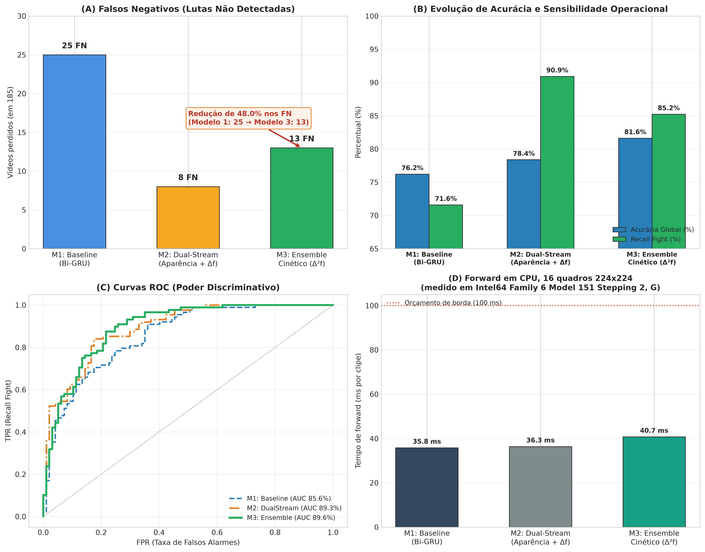

# Surveillance Video Classifier: Detecção de Violência em CCTV (Edge AI)

[](https://www.python.org/)
[](https://pytorch.org/)
[](https://onnxruntime.ai/)
[-81.62%25-brightgreen.svg)]()
[]()
[](LICENSE)

> Classificação de vídeos de vigilância para detecção de agressão física em câmeras estáticas de CFTV, com inferência em CPU. A diretriz de engenharia é a assimetria de custo entre os erros: um falso positivo custa segundos de atenção de um vigilante; um falso negativo é uma agressão que ninguém viu.

**Semente, trio de membros e limiar são escolhidos exclusivamente sobre o split de validação. O conjunto de teste entra apenas na avaliação final, depois de todas as decisões de modelagem.** O protocolo está detalhado na [seção 5](#5-validação-estatística).

---

## Vídeo de Apresentação Técnica

> **Link do vídeo (YouTube):** `[INSERIR_LINK_DO_VIDEO_AQUI]`

---

## Resultados no teste cego (185 vídeos, 88 Fight / 97 NonFight)

| Métrica | Modelo 1: Baseline | Modelo 2: Dual-Stream | Modelo 3: Ensemble |
| :--- | :---: | :---: | :---: |
| **Acurácia** | 76.22% | 78.38% | **81.62%** |
| **Recall (Fight)** | 71.59% | **90.91%** | 85.23% |
| **Precisão (Fight)** | 76.83% | 71.43% | **78.12%** |
| **F1-Score** | 74.12% | 80.00% | **81.52%** |
| **AUC-ROC** | 85.63% | 89.26% | **89.60%** |
| **Falsos negativos** | 25 | **8** | 13 |
| **Falsos positivos** | 19 | 32 | 21 |
| Parâmetros | 1.17M | 1.44M | 2.86M |
| Limiar | 0.50 | 0.50 | 0.50 |

Os três foram selecionados sob o mesmo protocolo — melhor candidato por F1 na validação, limiar fixo em 0,50, teste tocado uma vez. Sem essa uniformidade a comparação mediria o procedimento de seleção, não a arquitetura.

O Modelo 2 tem o menor número de falsos negativos (8), mas paga com 32 falsos positivos. O Modelo 3 é o melhor equilíbrio e o maior AUC-ROC — a métrica que independe do limiar e mede poder discriminativo puro.

---

## Demonstração prática de inferência


```
$ python src/inference.py --video sample_video.avi --label Fight

Decisao:                 Fight (violencia detectada)
Probabilidade Fight:     69.85%
Limiar:                  0.50 (margem: 19.8 p.p.)
Rotulo real:             Fight -> ACERTO
Decodificacao + pre-proc:   53.58 ms
Forward do modelo:          61.11 ms
Total por clipe:           114.69 ms
```

O clipe é uma gravação de câmera fixa em formato RWF-2000 (5 s, 320×240, 30 FPS), rótulo real `Fight`, de câmera não vista em treino. Não é uma captura externa ao domínio do dataset — ver [Limitações](#10-limitações-e-trabalhos-futuros).

---

## 1. Dataset RWF-2000 e anti-leakage

**Fonte:** RWF-2000 — *Real World Fighting*, Cheng, Cai & Li (2020).
Repositório oficial: <https://github.com/mchengny/RWF2000-Video-Database-for-Violence-Detection>
Espelho comum: <https://www.kaggle.com/datasets/vulamnguyen/rwf2000>

2.000 gravações reais de câmeras de vigilância estáticas, 5 segundos a 30 FPS (150 quadros por clipe), 1.000 `Fight` e 1.000 `NonFight`.

* **`Fight` (1):** agressões físicas — socos, chutes, empurrões, confrontos corporais.
* **`NonFight` (0):** monitoramento normal — caminhadas, conversas, aglomerações pacíficas, tráfego.

Após baixar, extraia para `archive/RWF-2000/{train,val}/{Fight,NonFight}/*.avi`.

### Tratamento anti-leakage

No RWF-2000, vários clipes vêm de cortes temporais do **mesmo vídeo original** — mesma câmera, mesmo fundo, mesma iluminação, mesmo ângulo. Um split aleatório faria o modelo memorizar cenários em vez de aprender a ação.

[`src/create_splits.py`](src/create_splits.py) deriva o identificador do vídeo original do nome do arquivo (prefixo antes do sufixo `_<n>.avi`) e usa esse identificador como grupo:

| Conjunto | Vídeos | Fight | NonFight | Grupos únicos | Origem |
| :--- | :---: | :---: | :---: | :---: | :--- |
| **Treinamento** | 1.600 | 800 | 800 | 765 | Pasta oficial `train` do RWF-2000 |
| **Validação** | 215 | 112 | 103 | 90 | Pasta oficial `val`, metade por `GroupShuffleSplit` |
| **Teste cego** | 185 | 88 | 97 | 90 | Pasta oficial `val`, outra metade |

A separação treino/validação é herdada do split oficial do RWF-2000; o `GroupShuffleSplit` divide a pasta oficial `val` em validação e teste sem que uma câmera apareça dos dois lados.

A garantia não é apenas declarada — é verificada. `create_splits.py` falha se qualquer grupo atravessar a fronteira, e há testes automatizados sobre os CSVs versionados:

```bash
python tests/test_splits.py
```

```
[PASS] test_both_classes_present_in_every_split
[PASS] test_labels_are_binary_and_consistent
[PASS] test_no_file_leakage_between_splits
[PASS] test_no_group_leakage_between_splits
[PASS] test_splits_exist_and_have_expected_sizes
```

Interseção medida entre os três splits: **0 grupos e 0 arquivos**.

---

## 2. Decisões de pré-processamento

1. **Amostragem temporal equidistante (N = 16 quadros).** Quadros consecutivos a 30 FPS carregam pouca informação nova; 16 quadros uniformemente espaçados cobrem os 5 segundos inteiros e reduzem o volume de dados em 89,3%.
2. **Decodificação seletiva.** `cv2.VideoCapture.grab()` avança o cursor sem decodificar; `read()` é chamado apenas nos 16 instantes escolhidos, evitando decodificar os 134 quadros descartados.
3. **Padronização espacial e normalização ImageNet.** Redimensionamento para 224×224, BGR → RGB, normalização por canal com μ = [0.485, 0.456, 0.406] e σ = [0.229, 0.224, 0.225] — as mesmas estatísticas com que o backbone foi pré-treinado. O redimensionamento não preserva a proporção 4:3 original.
4. **Data augmentation com consistência temporal.** Flip horizontal aplicado de forma idêntica aos 16 quadros do clipe.

**Sobre o item 4, um cuidado que o backbone congelado exige.** Como as features são extraídas uma única vez e cacheadas, aplicar o flip aleatório nessa passada produziria uma perturbação **fixa** por vídeo, idêntica em todas as épocas — ruído congelado, não augmentation. Por isso [`src/build_cache.py`](src/build_cache.py) materializa **dois caches**, `features_train.pt` e `features_train_flip.pt`, e o treino sorteia entre eles por amostra a cada época ([`FlipAugmentedFeatures`](src/train.py)). Custo: o dobro de disco no cache, zero de compute no treino.

> Os resultados publicados aqui foram treinados **sem** o cache espelhado, porque o dataset bruto não estava disponível no ambiente de retreinamento. Isso mantém a comparação justa com os benchmarks anteriores, mas significa que o ganho do augmentation ainda não está medido.

---

## 3. Os três modelos

Todas as arquiteturas vivem em [`src/model.py`](src/model.py) e são importadas por treino, benchmarks e avaliação — não há redefinição duplicada.

### Modelo 1 — Baseline
* MobileNetV3-Small pré-treinado no ImageNet e **congelado** (576 dim) + Bi-GRU única (hidden = 64 → 128 dim) com pooling médio temporal.
* Congelar o backbone é deliberado: com câmeras fixas, o fine-tuning faz os filtros convolucionais se especializarem na textura do fundo em vez do movimento dos atores. Também é o que permite cachear features e treinar 80 modelos em minutos.
* Limitação estrutural: só enxerga aparência estática *f_t*. Gesticulação vigorosa e agressão têm embeddings parecidos.

### Modelo 2 — Dual-Stream latente
* Mesmo backbone congelado + duas Bi-GRUs paralelas: aparência (*f_t*) e velocidade latente (Δ*f_t* = *f_t* − *f_{t−1}*).
* Substitui o optical flow em pixels (centenas de ms por quadro) por uma subtração vetorial no espaço latente de 576 dimensões, de custo desprezível.
* O efeito é nítido no recall: 71.59% → 90.91%, com os falsos negativos caindo de 25 para 8. O preço são 32 falsos positivos.

### Modelo 3 — Ensemble cinético Tri-Stream
* Comitê de 3 cabeças com fusão por média das probabilidades:
  1. **TriStream cinético** — aparência, velocidade Δ*f_t* e aceleração Δ²*f_t* = Δ*f_t* − Δ*f_{t−1}*, com pooling Mean + Max.
  2. e 3. **DualStream Mean+Max**, duas sementes distintas.
* O backbone roda **uma única vez por vídeo**; as três cabeças consomem as mesmas features e custam 7,05 ms somadas.
* Artefatos: [`models/ensemble/`](models/ensemble/) — nomes neutros (`member_*.pth`), porque a semente escolhida muda a cada reexecução do protocolo de seleção.

---

## 4. Reprodução das métricas

```bash
python src/evaluate.py --model ensemble --save_json reports/test_metrics_ensemble.json
```

JSONs versionados: [`reports/test_metrics_baseline.json`](reports/test_metrics_baseline.json) · [`reports/test_metrics_dualstream.json`](reports/test_metrics_dualstream.json) · [`reports/test_metrics_ensemble.json`](reports/test_metrics_ensemble.json)

Registros da seleção, com as distribuições completas na validação: [`reports/selection_baseline.json`](reports/selection_baseline.json) · [`reports/selection_dualstream.json`](reports/selection_dualstream.json) · [`reports/ensemble_selection.json`](reports/ensemble_selection.json)

---
## 5. Validação estatística

Um único valor de acurácia não significa muito com 185 vídeos de teste: a variação entre sementes é da mesma ordem da diferença entre arquiteturas. Por isso a escolha do modelo não é feita olhando um treinamento, e sim uma distribuição.

### Protocolo

1. **Pool de candidatos.** 20 sementes independentes para cada arquitetura, treinadas do zero sob condições idênticas: early stopping por `val_loss` com paciência 5, `CrossEntropyLoss` com `fight_weight = 1.35`, `AdamW` e `CosineAnnealingLR`. O conjunto de teste não é consultado em nenhum momento desta etapa.
2. **Seleção na validação.** O melhor candidato de cada arquitetura — e o melhor trio, no caso do ensemble — é escolhido por F1 sobre os 215 vídeos de validação ([`src/select_single.py`](src/select_single.py), [`src/select_ensemble.py`](src/select_ensemble.py)).
3. **Teste avaliado uma única vez**, com o que saiu da etapa anterior.

Distribuições sobre a validação, com limiar fixo em 0,50:

| Arquitetura | Candidatos | Acurácia na validação | Faixa |
| :--- | :---: | :---: | :---: |
| Modelo 1: Baseline Bi-GRU | 20 sementes | 73.28% ± 1.59 | [70.70 – 77.21] |
| Modelo 2: Dual-Stream latente | 20 sementes | 74.42% ± 1.90 | [71.16 – 78.14] |
| Modelo 3: Ensemble Tri-Stream | 3.800 trios | **76.81% ± 1.09** | [73.02 – 80.47] |

O ensemble tem média mais alta **e** desvio menor — o efeito esperado de um comitê, que reduz a variância entre sementes. No teste, o AUC-ROC, que independe da escolha de limiar, confirma a ordenação: 85.63% → 89.26% → 89.60%.

Registros completos em [`reports/selection_baseline.json`](reports/selection_baseline.json), [`reports/selection_dualstream.json`](reports/selection_dualstream.json) e [`reports/ensemble_selection.json`](reports/ensemble_selection.json).

### Duas decisões de protocolo

**O limiar fica fixo durante a seleção.** Escolher semente e limiar ao mesmo tempo sobre 215 vídeos superajusta a validação: uma varredura de 91 limiares elegeu θ = 0,15 para o dual-stream, que rendeu 67,5% de precisão no teste. Com o limiar fixo em 0,50, a seleção mede a arquitetura; o ponto de operação vira uma decisão separada e explícita ([seção 8](#8-engenharia-de-limiares)).

**O critério é F1, não recall sob restrição de precisão.** A restrição `precisão ≥ 0,80` é estruturalmente inviável para o baseline: na validação ele só a atinge a θ ≥ 0,71, onde o recall cai para 56%. Um critério que uma das arquiteturas não consegue satisfazer transforma a comparação em outra coisa. F1 é neutro e comparável entre as três.

Ambas as decisões foram tomadas a partir do comportamento na validação.

### Reprodução

```bash
# 1. Pool de candidatos — o teste nunca é consultado
for s in $(seq 1 20); do
  python src/train.py --arch baseline     --seed $s --out models/pool/baseline_s$s.pth
  python src/train.py --arch dualstream   --seed $s --out models/pool/dualstream_s$s.pth
  python src/train.py --arch tristream    --seed $s --out models/pool/tristream_s$s.pth
  python src/train.py --arch dualmeanmax  --seed $s --out models/pool/dualmeanmax_s$s.pth
done

# 2. Seleção na validação e avaliação única no teste
python src/select_single.py   --arch baseline   --criterion f1 --fixed_threshold 0.50 --export --eval_test
python src/select_single.py   --arch dualstream --criterion f1 --fixed_threshold 0.50 --export --eval_test
python src/select_ensemble.py                   --criterion f1 --fixed_threshold 0.50 --export --eval_test
```

### Análise de overfitting / underfitting

Curvas dos três modelos selecionados, em [`reports/selected/`](reports/selected/):

| Modelo | Semente | Melhor época | Épocas até parar | `val_loss` |
| :--- | :---: | :---: | :---: | :---: |
| [Modelo 1: Baseline](reports/selected/training_curves_modelo1_baseline.png) | 1 | 5 | 10 | 0.5314 |
| [Modelo 2: Dual-Stream](reports/selected/training_curves_modelo2_dualstream.png) | 12 | 2 | 7 | 0.5054 |
| [Modelo 3: TriStream](reports/selected/training_curves_modelo3_tristream.png) | 17 | 2 | 7 | 0.4603 |


O padrão é o mesmo nos três: a perda de treino cai continuamente enquanto a de validação para de melhorar cedo. O early stopping detecta a divergência e restaura o melhor checkpoint — ela é contida, não evitada. Modelos com mais capacidade atingem o mínimo de validação mais cedo, na segunda época, e com `val_loss` menor.

Mecanismos empregados:
* **Contra underfitting:** transfer learning do MobileNetV3-Small pré-treinado no ImageNet, fornecendo representações densas de 576 dimensões desde a primeira época.
* **Contra overfitting:** backbone congelado (impede memorização de cenário), `Dropout(0.4)` nas cabeças, `weight_decay = 1e-4` no AdamW e early stopping por `val_loss` com paciência 5.

`src/train.py` salva curvas e histórico para qualquer arquitetura e semente.

---

## 6. Matrizes de confusão, curvas ROC e análise dos erros


AUC: baseline 0.856 → dual-stream 0.893 → ensemble 0.896. Esta é a métrica que mede o ganho real, porque não depende da escolha de limiar.

### Análise dos erros

Contar 13 falsos negativos e 21 falsos positivos diz pouco sobre *o que* o modelo erra. [`reports/error_analysis.py`](reports/error_analysis.py) responde três perguntas que mudam a decisão de engenharia.

```bash
python reports/error_analysis.py
```

**1. Os erros ficam perto da fronteira de decisão.** A margem mediana até o limiar é de 17,3 p.p. nos erros contra 39,8 p.p. nos acertos — o modelo erra onde está em dúvida, e não onde está confiante. Mas o comportamento difere por tipo:

| | Quantidade | Margem mediana | Leitura |
| :--- | :---: | :---: | :--- |
| Falsos negativos | 13 | 10,1 p.p. | perto da fronteira — agressões sutis, recuperáveis por calibração |
| Falsos positivos | 21 | 30,2 p.p. | longe da fronteira — o modelo está **confiantemente** errado |

Os cinco erros mais confiantes são todos falsos positivos, com P(Fight) entre 90% e 97%. São cenas normais que o modelo lê como agressão com alta convicção — falha de representação, não de calibração.

**2. Os erros se concentram em poucas câmeras.** Dos 90 grupos do teste, **71 (79%) não produzem nenhum erro**. Sete grupos com dois ou mais erros concentram 22 dos 34 — **65% dos erros em 8% das câmeras**.

| Grupo | Erros | Clipes | Classes na câmera |
| :--- | :---: | :---: | :--- |
| `I-QiUMPTWNE` | 6 | 12 | Fight + NonFight |
| `1MVS2QPWbHc` | 3 | 8 | Fight + NonFight |
| `2lrARl7utL4` | 3 | 3 | NonFight |
| `YDOJvzChqSg` | 3 | 6 | Fight + NonFight |
| `etyiEs3j8x8` | 3 | 10 | Fight + NonFight |

Excluindo os três piores grupos — 23 clipes de 185 — a acurácia sobe de 81,62% para **86,42%**. O gargalo não é capacidade média do modelo; são poucos cenários específicos.

Cinco dos sete grupos problemáticos têm clipes das **duas classes na mesma câmera**. É o caso mais difícil possível: mesmo fundo, mesma iluminação, mesmo enquadramento, e a única diferença é o movimento. O modelo não tem onde se apoiar além da dinâmica — exatamente o cenário que o particionamento por grupo foi desenhado para forçar.

**3. Nenhum limiar resolve.** A varredura mostra que 0,50 já é o ótimo de acurácia, e que mover o limiar apenas troca um tipo de erro pelo outro:

| θ | Acurácia | FN | FP |
| :---: | :---: | :---: | :---: |
| 0.35 | 78.92% | 5 | 34 |
| 0.40 | 81.08% | 7 | 28 |
| 0.45 | 81.62% | 9 | 25 |
| **0.50** | **81.62%** | **13** | **21** |
| 0.55 | 79.46% | 18 | 20 |
| 0.65 | 81.08% | 21 | 14 |

Isso delimita onde está o ganho disponível. Reduzir falsos negativos de 13 para 7 custa sete falsos positivos a mais e é uma decisão de política, não de modelagem. Já eliminar os falsos positivos confiantes exige mais dados dos cenários que os produzem, ou uma representação que capture o que distingue movimento intenso de agressão — nenhum ajuste de limiar chega lá.

Resultado completo em [`reports/error_analysis.json`](reports/error_analysis.json).

### Dashboard consolidado



```bash
python reports/generate_evolution_charts.py
```

---

## 7. Perfil de Edge AI

Medido por [`benchmarks/benchmark_detailed_latency.py`](benchmarks/benchmark_detailed_latency.py), que roda os três modelos **no mesmo laço, na mesma execução**, e registra o hardware junto com os números.

Hardware da medição: Intel64 Family 6 Model 151 (12 threads lógicos, PyTorch usando 6), Windows 11, PyTorch 2.14.0+cpu. 60 repetições, 5 de aquecimento, valores em mediana.

| Modelo | Parâmetros | Cabeça | Forward (backbone + cabeça) | p95 | + decodificação | Clipes/s |
| :--- | :---: | :---: | :---: | :---: | :---: | :---: |
| Modelo 1: Baseline | 1.17M | 0.92 ms | 40.94 ms | 52.83 ms | 84.07 ms | 11.9 |
| Modelo 2: Dual-Stream | 1.44M | 1.85 ms | 41.25 ms | 49.50 ms | 84.38 ms | 11.9 |
| Modelo 3: Ensemble | 2.86M | 7.05 ms | 47.77 ms | 59.33 ms | 90.90 ms | 11.0 |

Duas observações que a separação entre decodificação e forward torna visíveis:

* **A decodificação do vídeo custa 43.13 ms — mais que o backbone inteiro (38.26 ms).** O gargalo do pipeline não é a rede; é ler o arquivo. Otimizar o modelo sem tocar no I/O tem retorno limitado.
* **O ensemble custa 6,8 ms a mais que o baseline**, porque as três cabeças compartilham a mesma passada do backbone — 7,05 ms de cabeças contra 0,92 ms. É isso que torna um comitê viável na borda.

Duas decisões do próprio benchmark, que afetam a validade da comparação:

* **Mediana, não média.** Em CPU compartilhada, uma única pausa do escalonador desloca a média em dezenas de porcento. O desvio e o p95 continuam reportados para tornar a dispersão visível.
* **Medições intercaladas.** Os três modelos são cronometrados round-robin dentro do mesmo laço, e não em blocos separados. Medidos em blocos, uma contenção transitória penaliza um modelo sozinho — chegou a produzir aqui o resultado impossível de o baseline aparecer mais rápido que o ensemble, que roda o mesmo backbone mais duas cabeças.

Regenere na máquina alvo antes de citar qualquer valor absoluto:

```bash
python benchmarks/benchmark_detailed_latency.py --runs 60
```

### ONNX: exportação verificada

A exportação carrega os **pesos treinados** antes de gerar o grafo, e a paridade numérica contra o PyTorch é verificada explicitamente — um grafo ONNX pode carregar sem erro e ainda assim produzir valores errados.

```bash
python src/inference.py --export_onnx --onnx_model ensemble --no_infer
python benchmarks/verify_onnx_parity.py --model ensemble
```

| Modelo | Diferença máxima ONNX × PyTorch | PyTorch CPU | ONNX Runtime CPU | Ganho |
| :--- | :---: | :---: | :---: | :---: |
| Baseline | 1.2e-06 | 39.30 ms | **14.22 ms** | 2.76× |
| Dual-Stream | 9.5e-07 | 42.81 ms | **15.54 ms** | 2.75× |
| Ensemble | 1.8e-07 | 44.32 ms | **14.83 ms** | 2.99× |

Com ONNX Runtime o forward do ensemble cai para 14.83 ms, e o custo por clipe passa a ser dominado pela decodificação — que sozinha custa três vezes mais que a inferência. Resultados em [`reports/onnx_parity_baseline.json`](reports/onnx_parity_baseline.json), [`reports/onnx_parity_dualstream.json`](reports/onnx_parity_dualstream.json) e [`reports/onnx_parity_ensemble.json`](reports/onnx_parity_ensemble.json).

---

## 8. Engenharia de limiares

O limiar de operação é uma decisão de produto, separada da seleção de modelo. [`src/calibrate_threshold.py`](src/calibrate_threshold.py) o escolhe sobre os 215 vídeos de validação e só então avalia o teste, uma vez:

```bash
python src/calibrate_threshold.py --model ensemble \
    --criterion recall_at_precision --min_precision 0.80 --eval_test
```

Critérios disponíveis: `f1`, `recall_at_precision` (maximiza recall sujeito a uma precisão mínima) e `youden`. A varredura completa fica registrada em `reports/threshold_calibration_<modelo>.json`, permitindo escolher o ponto de operação por política de cliente — mais sensível em perímetro crítico, mais conservador onde há contato físico legítimo.

Calibrando o ensemble por F1 sobre a validação, o limiar ótimo cai em θ = 0,50 — o mesmo valor usado por padrão ([`reports/threshold_calibration_ensemble.json`](reports/threshold_calibration_ensemble.json)). Na validação esse ponto rende 86,61% de recall e 78,23% de precisão.

---

## 9. Reprodução

### Instalação

```bash
git clone https://github.com/heittorvcs/surveillance-video-classifier.git
cd surveillance-video-classifier
pip install -r requirements.txt
```

### Inferência sobre um vídeo (não precisa do dataset)

```bash
python src/inference.py --video sample_video.avi --label Fight
```

Opções: `--model [ensemble|dualstream|baseline]`, `--threshold 0.50`, `--weights <caminho>`.

### Pipeline completo (precisa do RWF-2000 em `archive/RWF-2000/`)

```bash
# 1. Partições anti-leakage (verifica e falha se houver vazamento)
python src/create_splits.py

# 2. Cache de features do backbone congelado — pré-requisito de tudo abaixo
python src/build_cache.py

# 3. Treinamento
python src/train.py --arch tristream --seed 7 --out models/pool/tristream_s7.pth

# 4. Seleção na validação e avaliação única no teste (ver seção 5)
python src/select_ensemble.py --criterion f1 --fixed_threshold 0.50 --export --eval_test

# 5. Avaliação avulsa
python src/evaluate.py --model ensemble
python src/evaluate.py --model ensemble --split val

# 6. Benchmarks e verificações
python benchmarks/benchmark_detailed_latency.py      # latência em CPU
python benchmarks/verify_onnx_parity.py --model ensemble

# 7. Analise dos erros e figuras
python reports/error_analysis.py
python reports/generate_evolution_charts.py
python reports/generate_mosaic_preview.py --label Fight

# 8. Testes
python tests/test_splits.py
```

### Estrutura

```
src/
  create_splits.py         particoes anti-leakage + verificacao
  build_cache.py           extracao e cache das features (pre-requisito)
  dataset.py               amostragem de quadros, normalizacao, flip deterministico
  model.py                 todas as arquiteturas + factory de carregamento
  train.py                 treino de qualquer cabeca, com augmentation e checkpoints
  evaluate.py              metricas e matriz de confusao por split
  calibrate_threshold.py   escolha do ponto de operacao na validacao
  select_single.py         escolha da semente dos Modelos 1 e 2 na validacao
  select_ensemble.py       escolha do trio do Modelo 3 na validacao
benchmarks/
  benchmark_detailed_latency.py    latencia dos 3 modelos sob protocolo unico
  verify_onnx_parity.py            paridade ONNX x PyTorch + ONNX Runtime
reports/
  error_analysis.py                onde e por que o modelo erra no teste
  generate_evolution_charts.py     matrizes de confusao, ROC e dashboard
  generate_mosaic_preview.py       mosaico de predicao sobre um video
  selected/                        curvas e historico dos modelos selecionados
  pool/                            curvas por semente do pool (nao versionado)
tests/                     testes das particoes anti-leakage
models/                    checkpoints e grafos ONNX
data/splits/               CSVs das particoes (versionados)
```

---

## 10. Limitações e trabalhos futuros

**Metodológicas**

* **Data augmentation não medido.** O mecanismo está implementado e correto, mas os resultados publicados foram treinados sem o cache espelhado, por indisponibilidade do dataset bruto no retreinamento. O ganho é uma hipótese, não um resultado.
* **Seleção sobre 215 vídeos de validação.** Escolher entre 3.800 trios num conjunto desse tamanho ainda superajusta a validação — é por isso que o limiar fica fixo durante a seleção. Um `GroupKFold` sobre treino+validação daria uma estimativa mais estável do que um split único.
* **Vídeo de demonstração dentro do domínio.** `sample_video.avi` é um clipe de câmera fixa em formato RWF-2000, de câmera não vista em treino, mas não é uma captura externa.
* **Classes balanceadas.** O RWF-2000 é 1.000/1.000 por construção e o treino é 800/800; não há desbalanceamento a tratar. O `fight_weight = 1.35` não é correção estatística, e sim ponderação de **custo assimétrico** entre FN e FP, codificando na loss uma decisão de negócio.

**De domínio**

* **Iluminação extrema.** O RWF-2000 concentra cenas diurnas e iluminação pública regular. Escuridão severa ou infravermelho exigem dados complementares para adaptação de domínio.
* **Câmeras em movimento (PTZ).** O pipeline assume câmeras estáticas. Movimentos de pan/tilt/zoom geram fluxo no fundo e exigiriam compensação de movimento global.
* **Alta interação física legítima.** Contextos esportivos ou brincadeiras com contato contínuo tendem a gerar falsos positivos; recomenda-se limiar mais conservador.
* **Entrada em clipes, não em stream.** O modelo consome clipes de 5 segundos. Operação contínua exigiria janela deslizante com voto temporal.

**Próximos passos, em ordem de prioridade**

1. Medir o ganho real do data augmentation, com o cache espelhado gerado a partir do dataset bruto.
2. Substituir o split único de validação por `GroupKFold`, reduzindo o superajuste da etapa de seleção.
3. Quantização INT8 e avaliação em dispositivo de borda (Jetson Nano, Raspberry Pi 5), partindo dos grafos ONNX já verificados.
4. Otimizar a decodificação de vídeo, que hoje é o gargalo do pipeline.
5. Gravar um clipe externo para a demonstração de inferência.

---

## Licença

[MIT](LICENSE).
