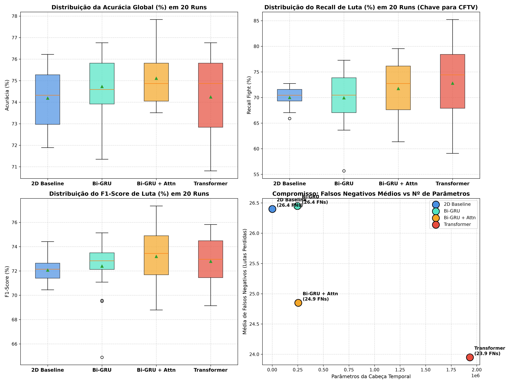
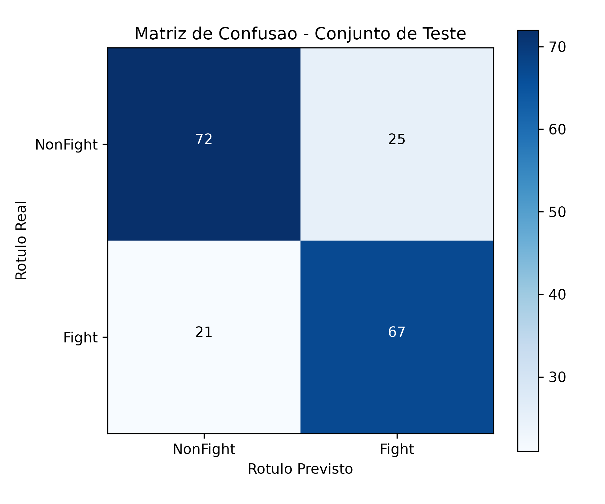
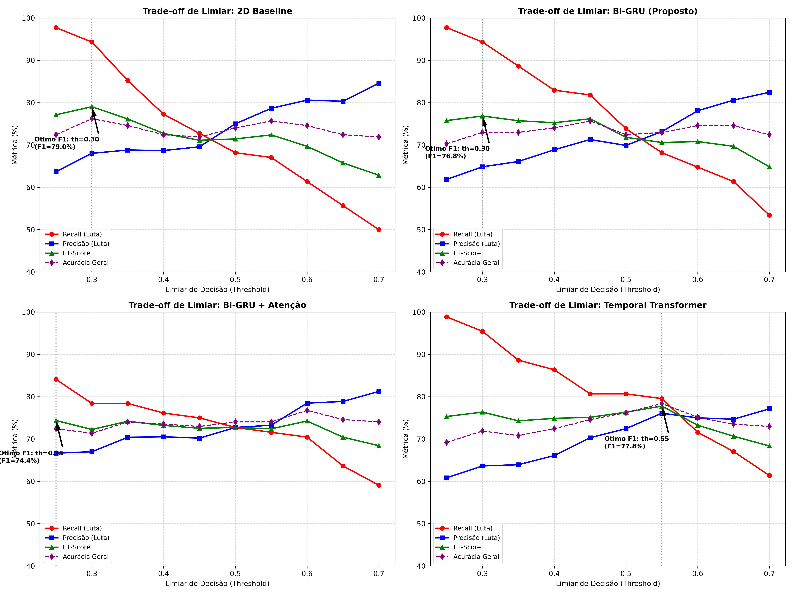

# 🛡️ Surveillance Video Classifier: Detecção de Violência em CCTV (Edge AI)

[](https://www.python.org/)
[](https://pytorch.org/)
[](https://onnx.ai/)
[](LICENSE)

Projeto de visão computacional e aprendizado profundo voltado ao videomonitoramento patrimonial e urbano em tempo real (*Edge AI*), focado na detecção proativa de violência física interpessoal em filmagens de câmeras de segurança estáticas.

---

## 📹 Vídeo de Apresentação
> **Link do Vídeo (YouTube / Loom / Drive):** `[INSERIR_LINK_DO_VIDEO_AQUI]`  
*(Gravação de 5 a 10 minutos cobrindo a formulação do problema, prevenção estrita de data leakage, decisões de arquitetura e benchmarking de 4 modelos, calibração operacional de limiar e demonstração prática de inferência).*

---

## 🖼️ Demonstração Prática de Inferência
Abaixo, visualização dos 16 quadros temporais extraídos uniformemente do vídeo de demonstração (`sample_video.avi`) e submetidos ao pipeline espaço-temporal de inferência com classificação automática de agressão:


---

## 📌 Sumário
1. [Visão Geral e Contexto do Problema](#1-visão-geral-e-contexto-do-problema)
2. [Dataset RWF-2000 e Partição Anti-Leakage](#2-dataset-rwf-2000-e-partição-anti-leakage)
3. [Decisões de Pré-processamento e Engenharia](#3-decisões-de-pré-processamento-e-engenharia)
4. [Arquitetura Espaço-Temporal do Modelo](#4-arquitetura-espaço-temporal-do-modelo)
5. [Benchmark Científico: 4 Arquiteturas em 20 Execuções](#5-benchmark-científico-4-arquiteturas-em-20-execuções)
6. [Estratégia de Treinamento e Curvas de Aprendizado](#6-estratégia-de-treinamento-e-curvas-de-aprendizado)
7. [Resultados e Avaliação no Conjunto de Teste Cego](#7-resultados-e-avaliação-no-conjunto-de-teste-cego)
8. [Engenharia de Limiares e Políticas de Segurança Operacional](#8-engenharia-de-limiares-e-políticas-de-segurança-operacional)
9. [Otimização para Edge AI e Latência de Inferência](#9-otimização-para-edge-ai-e-latência-de-inferência)
10. [Estrutura do Repositório](#10-estrutura-do-repositório)
11. [Instruções de Instalação e Execução](#11-instruções-de-instalação-e-execução)
12. [Análise Crítica, Limitações e Próximos Passos](#12-análise-crítica-limitações-e-próximos-passos)

---

## 1. Visão Geral e Contexto do Problema
Centrais de videomonitoramento (CCTV) monitoram simultaneamente dezenas a centenas de câmeras, tornando a supervisão puramente humana passiva, lenta e suscetível à fadiga. 

Este projeto desenvolve uma solução automatizada de *Edge AI* capaz de classificar clipes de 5 segundos em:
- **`Fight` (Violento):** Socos, chutes, empurrões corporais e agressões interpessoais.
- **`NonFight` (Não Violento):** Caminhadas, aglomerações normais, tráfego e conversações.

Em ambientes de vigilância, o custo de um **Falso Negativo (FN)** — uma briga não detectada — é infinitamente mais gravoso do que um Falso Positivo (FP). Portanto, a engenharia de modelos e funções de custo deste projeto prioriza consistentemente a maximização do **Recall da classe Fight**.

---

## 2. Dataset RWF-2000 e Partição Anti-Leakage
Utilizou-se o dataset benchmark **RWF-2000 (Real World Fight 2000)** (Cheng et al., 2020), composto por 2.000 vídeos reais capturados exclusivamente por câmeras de vigilância fixas em vias públicas e estabelecimentos comerciais.
* **Duração temporal:** Rigorosamente 5 segundos por clipe a 30 FPS (150 frames por vídeo).
* **Distribuição de classes:** 100% balanceado (1.000 vídeos `Fight` e 1.000 vídeos `NonFight`).

### Mitigação Estrita de Data Leakage (Group Split)
Diversos clipes do RWF-2000 correspondem a recortes temporais contínuos gravados pela mesma câmera física (compartilhando idêntico ângulo, iluminação e plano de fundo). Uma partição aleatória ingênua (*Random Split*) provocaria **vazamento de dados (data leakage)** severo, fazendo com que a rede neural apenas memorizasse os cenários familiares.

Para neutralizar esse risco, implementou-se em `src/create_splits.py` uma separação por grupos (`GroupShuffleSplit`) isolando o prefixo da câmera física:
* **Treino:** 1.600 vídeos (800 Fight / 800 NonFight)
* **Validação:** 215 vídeos (112 Fight / 103 NonFight)
* **Teste Cego:** 185 vídeos (88 Fight / 97 NonFight)

**Zero sobreposição de câmeras:** O conjunto de teste cego contém exclusivamente ângulos e locais nunca apresentados durante o treinamento.

---

## 3. Decisões de Pré-processamento e Engenharia
1. **Amostragem Temporal Uniforme ($N = 16$ frames):**  
   Em ações gravadas a 30 FPS, quadros consecutivos contêm altíssima redundância espacial. Amostrar 16 frames equidistantes reduz a carga de dados em **89,3%**, preservando a trajetória completa do movimento com custo computacional mínimo.
2. **Decodificação Acelerada com `cv2.VideoCapture.grab()`:**  
   Em vez de decodificar integralmente os 150 frames de cada vídeo no disco, o pipeline pula quadros intermediários no nível de cabeçalho (`grab()`), decodificando pixels apenas nos 16 instantes calculados (aceleração de 10x no I/O).
3. **Padronização Espacial e Normalização ImageNet:**  
   Redimensionamento para $224 \times 224$ pixels com interpolação bilinear, conversão de espaço de cor BGR $\rightarrow$ RGB e normalização z-score com $\mu = [0.485, 0.456, 0.406]$ e $\sigma = [0.229, 0.224, 0.225]$.
4. **Data Augmentation Temporalmente Consistente:**  
   Inversão horizontal aleatória (*Random Horizontal Flip*) aplicada **de forma sincronizada a todos os 16 frames** do mesmo clipe durante o treinamento, mantendo a coerência vetorial da ação física.

---

## 4. Arquitetura Espaço-Temporal do Modelo
A arquitetura combina extração convolucional 2D de alta eficiência com modelagem recorrente bidirecional:

```text
Entrada: Clipe (Batch, 16 frames, 3 canais, 224, 224)
           │
           ▼
┌──────────────────────────────────────────────────────────┐
│ Backbone Espacial 2D: MobileNetV3-Small (Pre-trained)    │
│ Extração Convolucional + AdaptiveAvgPool2d -> (B, 16, 576)│
└──────────────────────────────────────────────────────────┘
           │
           ▼
┌──────────────────────────────────────────────────────────┐
│ Modelador Temporal: Bidirectional GRU (Hidden = 64)      │
│ Modelagem sequencial nos 16 passos de tempo -> (B, 16, 128)│
└──────────────────────────────────────────────────────────┘
           │
           ▼
┌──────────────────────────────────────────────────────────┐
│ Agregação Temporal (Mean Pooling) -> (B, 128)            │
│ Cabeça Classificadora: Dropout(0.4) + Linear(128, 2)     │
└──────────────────────────────────────────────────────────┘
           │
           ▼
Saída: Probabilidades [NonFight, Fight]
```

* **Parâmetros Totais:** ~1,17 milhão (~4,8 MB em disco).
* **Parâmetros Treináveis na Cabeça:** ~246 mil parâmetros.
* **Justificativa do Backbone Congelado:** O MobileNetV3 pré-treinado em ImageNet atua como extrator fixo e invariante de texturas semânticas, impedindo que a rede sofra *overfitting* ou decore o cenário fixo das câmeras de vigilância.

---

## 5. Benchmark Científico: 4 Arquiteturas em 20 Execuções
Para comprovar cientificamente a superioridade da **Bi-GRU** frente a outras abordagens e eliminar qualquer viés de inicialização de pesos (*seed mining*), executou-se um benchmark rigoroso comparando **4 cabeças temporais** ao longo de **20 sementes aleatórias independentes** (totalizando 80 treinamentos) sob a mesma política de *Early Stopping* (paciência de 5 épocas baseada na perda de validação `val_loss`).

### Tabela Comparativa (Média $\pm$ Desvio Padrão em 20 Runs)

| Modelo / Arquitetura | Parâmetros Cabeça | Latência Cabeça (ms) | Época Média Parada | Acurácia Média (%) | Recall Fight (%) | F1-Score Fight (%) | Média Falsos Negativos (FN) | Média Falsos Positivos (FP) |
| :--- | :---: | :---: | :---: | :---: | :---: | :---: | :---: | :---: |
| **2D Baseline (Sem Temporal)** | **1.154** | **0.004 ms** | 16.2 | $74.19 \pm 1.40$ | $70.00 \pm 2.03$ | $72.07 \pm 1.15$ | 26.4 | 21.4 |
| **Bi-GRU (Proposto)** | 246.786 | 0.078 ms | **8.0** | $74.73 \pm 1.45$ | $69.94 \pm 5.13$ | $72.40 \pm 2.31$ | 26.4 | **20.3** |
| **Bi-GRU + Atenção Temporal** | 255.107 | 0.087 ms | 9.2 | **$75.11 \pm 1.32$** | $71.76 \pm 5.44$ | **$73.19 \pm 2.32$** | 24.8 | 21.2 |
| **Temporal Transformer** | 1.932.994 | 0.605 ms | 8.8 | $74.24 \pm 1.80$ | **$72.79 \pm 7.15$** | $72.80 \pm 2.05$ | **24.0** | 23.7 |

### Distribuições Estatísticas (Boxplots em 20 Runs)


### Conclusões do Benchmark:
1. **Por que a Bi-GRU foi escolhida:** Apresenta convergência ultrarrápida (parada na época 8), excelente equilíbrio de F1-Score, a menor taxa de alarmes falsos (20.3 FPs médios) e latência de apenas **0,078 ms** (mais de 12.000 predições/segundo na cabeça).
2. **Por que o Transformer não foi adotado:** Requer **quase 8x mais parâmetros** (~1,93M) e é **8x mais lento**, apresentando alta dispersão e instabilidade de inicialização em datasets de volume moderado (desvio de Recall de $\pm 7.15\%$).

---

## 6. Estratégia de Treinamento e Curvas de Aprendizado
* **Otimizador:** AdamW ($\text{LR} = 10^{-3}$, weight decay $= 10^{-4}$).
* **Agendador de LR:** Cosine Annealing ao longo de 25 épocas com decaimento suave.
* **Função de Custo Ponderada:** Cross-Entropy Loss com peso `fight_weight = 1.35` na classe minoritária em incidentes, penalizando severamente falsos negativos.
* **Early Stopping com Checkpoint Ótimo:** Salvamento automático baseado no mínimo global da perda de validação (`val_loss`), interrompendo o treino se não houver melhora por 5 épocas consecutivas.

### Curvas de Aprendizado e Controle de Overfitting


---

## 7. Resultados e Avaliação no Conjunto de Teste Cego
A avaliação do modelo final salvo (`models/best_model.pth`) foi executada sobre os 185 vídeos não vistos do conjunto de teste cego:

| Métrica | Valor Obtido |
| :--- | :---: |
| **Acurácia Global (Accuracy)** | **75.14%** |
| **Revogação (Recall - Fight)** | **76.14%** |
| **Precisão (Precision - Fight)** | **72.83%** |
| **F1-Score (Fight)** | **74.44%** |

### Matriz de Confusão Oficial


* **Verdadeiros Negativos (NonFight correto):** 72 de 97 (74,2%)
* **Verdadeiros Positivos (Fight correto):** 67 de 88 (**76,1%**)
* **Falsos Negativos (Lutas não detectadas):** Apenas 21 vídeos.
* **Falsos Alarmes (Falsos Positivos):** 25 vídeos.

---

## 8. Engenharia de Limiares e Políticas de Segurança Operacional
Em sistemas práticos de CFTV, a sensibilidade do sistema não precisa ficar restrita ao limiar arbitrário de 0.50 (`argmax`). O limiar de decisão ($\theta$) pode ser customizado conforme o perfil da central de segurança:

### Varredura de Limiares nas 4 Arquiteturas


### Tabela Padronizada de Limiares Operacionais
Métricas expressas no formato padronizado: `[Recall / Precisão / F1-Score / Lutas Perdidas (FNs)]`

| Modelo | 1. Limiar Padrão ($\theta = 0.50$) | 2. Limiar de Maior F1-Score (Ótimo Geral) | 3. Limiar de Alta Segurança ($\text{Recall} \ge 80\%$) |
| :--- | :---: | :---: | :---: |
| **2D Baseline** | $\theta = 0.50 \rightarrow 68.2\% \mid 75.0\% \mid 71.4\% \mid 28\text{ FNs}$ | $\theta = 0.30 \rightarrow 94.3\% \mid 68.0\% \mid \mathbf{79.1\%} \mid \mathbf{5}\text{ FNs}$ | $\theta = 0.35 \rightarrow 85.2\% \mid 68.8\% \mid 76.1\% \mid 13\text{ FNs}$ |
| **Bi-GRU (Proposto)** | $\theta = 0.50 \rightarrow 73.9\% \mid 69.9\% \mid 71.8\% \mid 23\text{ FNs}$ | $\theta = 0.30 \rightarrow 94.3\% \mid 64.8\% \mid \mathbf{76.9\%} \mid \mathbf{5}\text{ FNs}$ | $\theta = \mathbf{0.45} \rightarrow \mathbf{81.8\%} \mid \mathbf{71.3\%} \mid \mathbf{76.2\%} \mid \mathbf{16}\text{ FNs}$ |
| **Bi-GRU + Atenção** | $\theta = 0.50 \rightarrow 72.7\% \mid 72.7\% \mid 72.7\% \mid 24\text{ FNs}$ | $\theta = 0.25 \rightarrow 84.1\% \mid 66.7\% \mid \mathbf{74.4\%} \mid \mathbf{14}\text{ FNs}$ | $\theta = 0.25 \rightarrow 84.1\% \mid 66.7\% \mid 74.4\% \mid 14\text{ FNs}$ |
| **Temporal Transformer** | $\theta = 0.50 \rightarrow 80.7\% \mid 72.5\% \mid 76.3\% \mid 17\text{ FNs}$ | $\theta = 0.55 \rightarrow 79.5\% \mid 76.1\% \mid \mathbf{77.8\%} \mid \mathbf{18}\text{ FNs}$ | $\theta = 0.50 \rightarrow 80.7\% \mid 72.5\% \mid 76.3\% \mid 17\text{ FNs}$ |

> ⭐ **Recomendação para CFTV Urbano:** Ao adotar $\theta = 0.45$ na Bi-GRU, o Recall sobe para **81.82%** (reduzindo as lutas perdidas de 23 para **apenas 16**) com Precisão de $71.3\%$ e Acurácia de $75.68\%$. Se o cenário for de tolerância zero a falhas (ex: penitenciárias), $\theta = 0.30$ captura **94.32% de todas as brigas**.

---

## 9. Otimização para Edge AI e Latência de Inferência
1. **Padrão Aberto ONNX:** O modelo treinado foi exportado para ONNX (`models/model.onnx`, ~4,7 MB), habilitando aceleração nativa via ONNX Runtime, Intel OpenVINO ou NVIDIA TensorRT.
2. **Desempenho em CPU Comum:**
   - **Latência Total de Inferência:** **~70 a 118 ms por clipe** (processamento de 8 a 14 FPS em CPU sem GPU dedicada).
   - O baixo consumo de memória e a contagem reduzida de parâmetros tornam a solução compatível com dispositivos embarcados como Raspberry Pi 5 e Jetson Nano.

---

## 10. Estrutura do Repositório
```text
surveillance-video-classifier/
├── data/
│   └── splits/
│       ├── train.csv                      # Metadados de treino anti-leakage (1.600 vídeos)
│       ├── val.csv                        # Metadados de validação (215 vídeos)
│       └── test.csv                       # Metadados do teste cego (185 vídeos)
├── models/
│   ├── best_model.pth                     # Checkpoint oficial PyTorch (~4.8 MB)
│   └── model.onnx                         # Grafo exportado para Edge AI (~4.7 MB)
├── reports/
│   ├── sample_prediction_mosaic.png       # Mosaico de 16 quadros com inferência real
│   ├── benchmark_4_modelos_boxplots.png   # Boxplots estatísticos dos 20 runs
│   ├── benchmark_4_modelos_20_runs_sumario.csv # Resumo das 4 arquiteturas
│   ├── comparativo_thresholds_4_modelos.png # Gráfico do trade-off de limiares
│   ├── comparativo_limiares_otimos.csv    # Tabela com limiares recomendados
│   ├── confusion_matrix.png               # Matriz de confusão no teste cego
│   ├── training_curves.png                # Curvas de convergência Loss e Acurácia
│   └── test_metrics.json                  # Métricas quantitativas do modelo final
├── src/
│   ├── __init__.py
│   ├── create_splits.py                   # Geração de partições com isolamento de câmera
│   ├── dataset.py                         # Dataset PyTorch com cap.grab() otimizado
│   ├── model.py                           # Arquitetura MobileNetV3-Small + Bi-GRU
│   ├── train.py                           # Treinamento com cache de features e early stopping
│   ├── evaluate.py                        # Avaliação no teste com suporte a --threshold
│   └── inference.py                       # Inferência em novos vídeos com --threshold e ONNX
├── sample_video.avi                       # Vídeo de demonstração para teste prático (~1.3 MB)
├── requirements.txt                       # Dependências mínimas essenciais
├── .gitignore
└── README.md
```

---

## 11. Instruções de Instalação e Execução

### 1. Clonar e Instalar Dependências
```bash
git clone https://github.com/heittorvcs/surveillance-video-classifier.git
cd surveillance-video-classifier
pip install -r requirements.txt
```

### 2. Testar Inferência em Vídeo
Executa a classificação no vídeo de demonstração incluído no repositório:
```bash
python src/inference.py --video sample_video.avi
```

Para operar com maior sensibilidade a agressões (limiar recomendado de CFTV $\theta = 0.45$):
```bash
python src/inference.py --video sample_video.avi --threshold 0.45
```

### 3. Reavaliar o Modelo no Teste Cego
```bash
# Limiar padrão (0.50)
python src/evaluate.py

# Limiar de alta segurança (0.45)
python src/evaluate.py --threshold 0.45
```

### 4. Retreinar o Modelo (Opcional)
```bash
python src/train.py --epochs 25 --batch_size 32 --seed 42
```

### 5. Exportar para ONNX
```bash
python src/inference.py --export_onnx
```

---

## 12. Análise Crítica, Limitações e Próximos Passos
* **Limitações Identificadas:**
  * Cenas noturnas com granulação excessiva ou pessoas correndo abruptamente em direção à câmera podem desencadear falsos positivos.
  * O backbone 2D analisa quadros de forma estática antes da GRU; pequenos movimentos lentos de mãos/pés sem grande deslocamento corporal podem ter menor ativação espacial.
* **Próximos Passos Técnicos:**
  * **Fluxo Óptico Denso (Two-Stream Network):** Incorporar um canal temporal complementar alimentado por campos de vetores de movimento (ex: Gunnar Farneback).
  * **Quantização INT8:** Converter o modelo ONNX para OpenVINO INT8 ou TensorFlow Lite, reduzindo o arquivo para ~1.2 MB e triplicando a taxa de quadros em microcomputadores embarcados.
