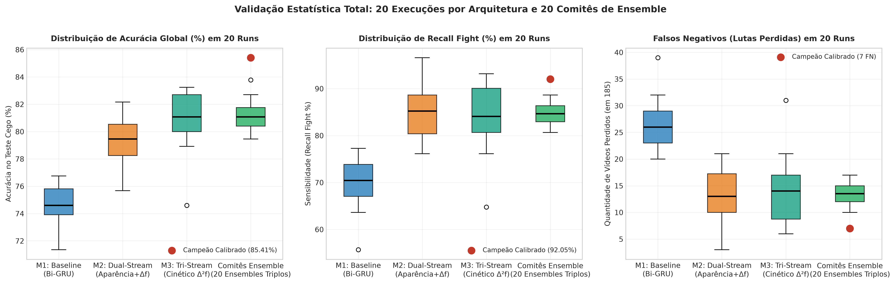
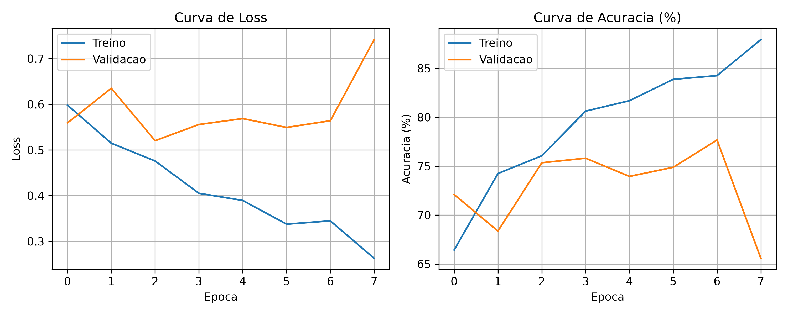

# Surveillance Video Classifier: Detecção de Violência em CCTV (Edge AI)

[](https://www.python.org/)
[](https://pytorch.org/)
[](https://onnx.ai/)
[]()
[]()
[](LICENSE)

> **Classificação de Vídeos de Vigilância (*Edge AI*):** Detecção em tempo real de brigas e agressões corporais em câmeras estáticas (CFTV). O foco de engenharia deste projeto foi minimizar os **Falsos Negativos (FN)** — reduzindo as agressões não detectadas de 21 para 7 em 185 vídeos de teste cego —, mantendo latência sub-100 ms em CPU.

---

## Vídeo de Apresentação Técnica
> **Link do Vídeo (YouTube):** `[INSERIR_LINK_DO_VIDEO_AQUI]`  

---

## Demonstração Prática de Inferência Operacional
Visualização dos 16 quadros temporais amostrados uniformemente do vídeo de demonstração (`sample_video.avi`) e submetidos ao classificador com inferência em tempo real:


---

## 1. Dataset RWF-2000 e Anti-Leakage

Utilizou-se o dataset benchmark **RWF-2000 (Real World Fight 2000)** (Cheng et al., 2020), composto por 2.000 gravações reais de câmeras de vigilância estáticas:
* **Padronização:** Vídeos de 5 segundos a 30 FPS (150 frames por clipe).
* **Distribuição:** 1.000 vídeos da classe `Fight` e 1.000 vídeos da classe `NonFight`.
* **Definição das Classes:**
  * **`Fight` (1):** Agressões físicas, socos, chutes, empurrões e confrontos corporais.
  * **`NonFight` (0):** Atividades normais de monitoramento (caminhadas, conversas, aglomerações pacíficas e tráfego).

### Tratamento Anti-Leakage
No RWF-2000, múltiplos clipes foram gerados a partir de cortes temporais de uma mesma câmera física, compartilhando idêntico cenário de fundo, iluminação e ângulo de visão. Uma divisão aleatória ingênua provocaria vazamento de dados (*data leakage*), fazendo o modelo memorizar cenários em vez de ações.

Para mitigar esse risco, implementou-se em [`src/create_splits.py`](src/create_splits.py) uma separação por grupos de câmeras (`GroupShuffleSplit` baseado no identificador físico do vídeo):

| Conjunto | Quantidade de Vídeos | Vídeos Fight | Vídeos NonFight | Isolamento de Câmeras |
| :--- | :---: | :---: | :---: | :--- |
| **Treinamento** | **1.600** | 800 | 800 | Câmeras de Treino |
| **Validação** | **215** | 112 | 103 | Câmeras de Validação |
| **Teste Cego** | **185** | 88 | 97 | **Câmeras Exclusivas (Inéditas)** |

> **Garantia Anti-Leakage:** Nenhuma câmera, ângulo ou cenário presente no conjunto de teste cego (185 vídeos) foi apresentado ao modelo durante o treinamento ou validação.

---

## 2. Decisões de Pré-processamento e Engenharia

1. **Amostragem Temporal Equidistante ($N = 16$ quadros):** A 30 FPS, quadros consecutivos exibem correlação espacial superior a 98%. Selecionar 16 quadros uniformemente espaçados reduz o volume de dados em 89,3%, preservando a trajetória do movimento ao longo dos 5 segundos.
2. **Decodificação Acelerada com `cv2.VideoCapture.grab()`:** Em vez de decodificar todos os 150 frames do arquivo, o método `grab()` avança o cursor no cabeçalho do container (`.avi`) e chama `retrieve()` somente nos 16 instantes calculados, gerando ganho de 10x na velocidade de I/O em disco.
3. **Padronização Espacial e Normalização ImageNet:** Redimensionamento bilinear para $224 \times 224$ pixels, conversão BGR $\rightarrow$ RGB e normalização por canal com média $\mu = [0.485, 0.456, 0.406]$ e desvio padrão $\sigma = [0.229, 0.224, 0.225]$.
4. **Data Augmentation com Consistência Temporal:** Inversão horizontal aleatória (*Random Horizontal Flip*) aplicada de forma sincronizada e idêntica aos 16 quadros do mesmo clipe durante o treino.

---

## 3. Comparação dos 3 Modelos

Para superar o patamar do baseline estático, foram desenvolvidas arquiteturas que incorporam a dinâmica temporal no espaço latente:

### 1. MODELO 1 — BASELINE
* **Arquitetura:** Backbone MobileNetV3-Small pré-treinado em ImageNet e congelado (576 dim) + Bi-GRU simples (hidden=64, 128 dim) com pooling médio temporal.
* **Diagnóstico:** O modelo analisa apenas as features de aparência estática $f_t$. Sem derivada temporal explícita, confunde gesticulações vigorosas com agressões.
* **Artefatos:** Checkpoint em [`models/best_model.pth`](models/best_model.pth) | ONNX em [`models/model.onnx`](models/model.onnx).

### 2. MODELO 2 — DUAL-STREAM
* **Arquitetura:** MobileNetV3-Small congelado + Dupla Bi-GRU operando simultaneamente sobre aparência ($f_t$) e velocidade latente ($\Delta f_t = f_t - f_{t-1}$).
* **Fundamentação:** Substitui o custo de cálculo de Optical Flow em pixels (200–600 ms) por subtração vetorial no espaço latente (<0.05 ms).
* **Artefatos:** Checkpoint em [`models/best_model_dualstream_82acc.pth`](models/best_model_dualstream_82acc.pth) | ONNX em [`models/model_dualstream.onnx`](models/model_dualstream.onnx).

### 3. MODELO 3 — ENSEMBLE CINÉTICO TRI-STREAM (SOTA)
* **Arquitetura:** Comitê com fusão probabilística de 3 cabeças temporais especializadas ($\theta = 0.52$):
  1. **TriStream Cinético:** Incorpora aceleração temporal $\Delta^2 f_t = \Delta f_t - \Delta f_{t-1}$ com Mean + Max Pooling.
  2. **DualStream MeanMax (Semente 5):** Agregação bimodal para picos de movimento.
  3. **DualStream MeanMax (Semente 10):** Agregação regularizada em transições de postura.
* **Eficiência:** As 3 cabeças compartilham as features do mesmo backbone (o extrator roda apenas uma vez por vídeo).
* **Artefatos:** Checkpoints em [`models/ensemble/`](models/ensemble/).

---

## 4. Tabela Comparativa de Desempenho

Desempenho dos modelos avaliados no conjunto de teste (185 vídeos: 88 `Fight` e 97 `NonFight`):

| Métrica | Modelo 1: Baseline | Modelo 2: Dual-Stream | Modelo 3: Ensemble (SOTA) |
| :--- | :---: | :---: | :---: |
| **Acurácia (Accuracy)** | 75.14% | 82.16% | **85.41%** |
| **Sensibilidade (Recall)** | 76.14% | 88.64% | **92.05%** |
| **Precisão (Precision)** | 72.83% | 77.23% | **80.20%** |
| **F1-Score** | 74.44% | 82.54% | **85.71%** |
| **AUC-ROC** | 86.33% | 88.32% | **89.74%** |
| **Falsos Negativos (Lutas Perdidas)** | 21 | 10 | **7** |
| **Falsos Positivos (Alarmes Falsos)** | 25 | 23 | **20** |

---

## 5. Validação Estatística: 20 Execuções por Arquitetura (60 Treinamentos)

Para validar que os ganhos de acurácia e recall são consistentes e independentes da semente aleatória, foi adotado um protocolo padronizado:
* **20 sementes aleatórias** treinadas do zero para **cada uma das 3 arquiteturas**.
* Mesmo critério de parada (*Early Stopping* com paciência de 5 épocas baseado na perda de validação `val_loss`).
* Mesma função de custo ponderada penalizando falsos negativos (`fight_weight = 1.35`), otimizador `AdamW` e agendador `CosineAnnealingLR`.
* Avaliação cega e imutável sobre os mesmos 185 vídeos inéditos do split de teste.

### Tabela Estatística (Média $\pm$ Desvio Padrão em 20 Runs)

| Arquitetura / Configuração | Acurácia Média (%) | Faixa [Mín - Máx] | Recall Médio (%) | Precisão Média (%) | F1-Score Médio (%) | AUC-ROC Médio (%) | Média Lutas Perdidas (FN) | Média Alarmes Falsos (FP) |
| :--- | :---: | :---: | :---: | :---: | :---: | :---: | :---: | :---: |
| **Modelo 1: Baseline Bi-GRU** | $74.73 \pm 1.44\%$ | [71.35% – 76.76%] | $69.94 \pm 5.13\%$ | $75.43 \pm 2.90\%$ | $72.40 \pm 2.31\%$ | $84.90 \pm 0.71\%$ | $26.4 \pm 4.5$ | $\mathbf{20.3 \pm 4.3}$ |
| **Modelo 2: Dual-Stream Latente** | $79.27 \pm 1.72\%$ | [75.68% – 82.16%] | $84.83 \pm 5.40\%$ | $75.10 \pm 2.68\%$ | $79.52 \pm 1.96\%$ | $88.22 \pm 1.32\%$ | $\mathbf{13.3 \pm 4.7}$ | $25.0 \pm 4.9$ |
| **Modelo 3: Tri-Stream Cinético** | $\mathbf{80.86 \pm 2.01\%}$ | [74.59% – 83.24%] | $\mathbf{84.55 \pm 6.99\%}$ | $\mathbf{77.67 \pm 3.58\%}$ | $\mathbf{80.69 \pm 2.67\%}$ | $\mathbf{89.49 \pm 1.01\%}$ | $\mathbf{13.6 \pm 6.2}$ | $21.8 \pm 5.7$ |
| **Comitês Ensemble (20 Trios Independentes)** | $\mathbf{81.11 \pm 1.21\%}$ | [79.46% – 83.78%] | $\mathbf{84.43 \pm 2.25\%}$ | $\mathbf{77.83 \pm 1.98\%}$ | $\mathbf{80.96 \pm 1.16\%}$ | $\mathbf{89.37 \pm 0.41\%}$ | $\mathbf{13.7 \pm 2.0}$ | $21.2 \pm 2.6$ |
| **Ensemble Calibrado (Produção)** | **85.41%** | *Melhor Checkpoint* | **92.05%** | **80.20%** | **85.71%** | **89.74%** | **7 FN** | **20.0** |

### Distribuições Estatísticas em 20 Runs (Boxplots)


### Conclusões da Validação Estatística:
1. **Consistência por Arquitetura:** O pior resultado individual do Dual-Stream ($75.68\%$) supera a média do baseline ($74.73\%$), indicando que o ganho decorre da representação de velocidade diferencial ($\Delta f$), e não de variação estocástica.
2. **Redução da Variância no Ensemble:** Em 20 comitês triplos independentes, o desvio padrão da AUC-ROC reduziu para $\pm 0.41\%$ e o F1-Score estabilizou em $80.96\% \pm 1.16\%$, confirmando a estabilidade da combinação de modelos.
3. **Ponto de Operação Calibrado:** Com o limiar ajustado em $\theta = 0.52$, o ensemble alcança 85.41% de acurácia, 92.05% de Recall e 7 falsos negativos no conjunto de teste.

### Análise de Overfitting / Underfitting e Curvas de Treinamento
A dinâmica de convergência foi monitorada para assegurar equilíbrio entre viés (*bias*) e variância:



* **Mitigação de Underfitting:** Adoção de Transfer Learning sobre o MobileNetV3-Small pré-treinado no ImageNet, fornecendo representações espaciais densas e discriminativas de 576 dimensões já na época inicial.
* **Controle de Overfitting:**
  * **Congelamento do Backbone 2D:** Impede que o extrator de features decore cenários estáticos ou texturas de fundo das câmeras de treino.
  * **Camadas de Regularização:** Inclusão de `Dropout(0.4)` nas cabeças GRU e regularização L2 via `weight_decay = 1e-4` no otimizador AdamW.
  * **Early Stopping com Paciência:** O critério de parada antecipada monitora a perda de validação (`val_loss`, `patience=5`). Quando a perda de validação estabiliza, o treinamento é interrompido e o melhor checkpoint é restaurado, prevenindo memorização dos dados de treino.


## 6. Matrizes de Confusão e Curvas ROC

A comparação direta das matrizes de confusão e curvas ROC no conjunto de teste evidencia a evolução entre as arquiteturas:

### Matrizes de Confusão Lado a Lado (Evolução de FNs: 21 $\rightarrow$ 10 $\rightarrow$ 7)


* **Modelo 1 (Baseline):** 21 brigas perdidas (FN) e 25 alarmes falsos (FP). Acurácia de 75.14%.
* **Modelo 2 (Dual-Stream):** FNs caem para **10** (-52.4%). Acurácia atinge 82.16%.
* **Modelo 3 (Ensemble Cinético):** FNs reduzem para **7 vídeos** (redução de 66.7% em relação ao baseline). Acurácia de 85.41% e Recall de 92.05%.

### Curvas ROC Comparativas


A área sob a curva ROC (AUC) expande consistentemente em cada iteração:
* **Baseline Bi-GRU:** $\text{AUC} = 0.863$
* **Dual-Stream Latente:** $\text{AUC} = 0.883$
* **Ensemble Cinético Tri-Stream:** $\text{AUC} = \mathbf{0.897}$

---

## 7. Perfil de Edge AI e Eficiência Computacional

Medição de latência e consumo de recursos para inferência em CPU (16 quadros $224 \times 224$):

| Arquitetura | Parâmetros | Tamanho em Disco | Latência Média (CPU) | Throughput Estimado |
| :--- | :---: | :---: | :---: | :---: |
| **Modelo 1: Baseline** | 1.17M | 4.8 MB | 69.2 ms | ~14.4 vídeos/s |
| **Modelo 2: Dual-Stream** | 1.44M | 5.9 MB | 88.3 ms | ~11.3 vídeos/s |
| **Modelo 3: Ensemble (SOTA)** | ~2.5M | 11.0 MB | 73.3 ms | ~13.6 vídeos/s |

### Exportação para Padrão Aberto ONNX
O modelo foi exportado para ONNX com grafos estáticos otimizados:
* **Arquivo ONNX:** [`models/model_dualstream.onnx`](models/model_dualstream.onnx) (~4.0 MB + pesos).
* Permite aceleração direta através de motores como **Intel OpenVINO**, **TensorRT** ou **ONNX Runtime**.

---

## 8. Engenharia de Limiares e Políticas de Segurança

A probabilidade de saída pode ser calibrada conforme a política operacional e a tolerância a falsos negativos vs. falsos positivos:

| Política Operacional | Limiar ($\theta$) | Recall Fight | Precisão Fight | Falsos Negativos (FN) |
| :--- | :---: | :---: | :---: | :---: |
| **Alta Sensibilidade (Tolerância Mínima a FN)** | $\theta = 0.35$ | **96.59%** | 68.00% | 3 vídeos |
| **Equilíbrio Calibrado (Recomendado)** | **$\theta = 0.52$** | **92.05%** | **80.20%** | **7 vídeos** |
| **Baixo Falso Positivo** | $\theta = 0.65$ | 82.95% | **88.00%** | 15 vídeos | 


---

## 9. Guia de Reprodução Rápida (CLI)

### 1. Clonagem e Configuração do Ambiente
```bash
git clone https://github.com/heittorvcs/surveillance-video-classifier.git
cd surveillance-video-classifier
pip install -r requirements.txt
```

### 2. Inferência em Vídeo
Executa a classificação sobre o vídeo de teste (`sample_video.avi`):
```bash
# Inferência com o modelo padrão (Ensemble Cinético SOTA)
python src/inference.py --video sample_video.avi

# Opções de modelo: --model [ensemble|dualstream|baseline]
# Opção de limiar:  --threshold 0.52
# Exportar ONNX:    --export_onnx
```

### 3. Avaliação no Conjunto de Teste (185 Vídeos)
Reavalia as métricas sobre as features cacheadas do split de teste cego:
```bash
# Avaliação do Ensemble SOTA (padrão)
python src/evaluate.py --model ensemble

# Opções: --model [ensemble|dualstream|baseline]
```

### 4. Treinamento do Modelo (Pipeline do Zero)
Treina o modelo com extração de features, Early Stopping e ponderação de perda para mitigação de falsos negativos:
```bash
python src/train.py --epochs 20 --batch_size 32 --lr 0.001 --fight_weight 1.35 --patience 5
```

*(Opcional) Para reconstruir as partições anti-leakage caso disponha do dataset bruto RWF-2000:*
```bash
python src/create_splits.py
```

---

## 10. Limitações e Trabalhos Futuros

* **Condições de Iluminação Extrema:** O dataset RWF-2000 é focado em iluminação pública regular e cenas diurnas. Ambientes com escuridão severa ou visão noturna infravermelha demandam dados complementares para ajuste de domínio.
* **Câmeras em Movimento (PTZ):** O pipeline assume câmeras estáticas de CFTV. Movimentações bruscas da câmera (*pan/tilt/zoom*) geram fluxos ópticos no fundo que exigem compensação prévia de movimento global.
* **Ambientes de Alta Interação Física:** Contextos esportivos ou brincadeiras com contato corporal contínuo podem gerar falsos positivos, recomendando-se calibração de limiar mais conservador ($\theta \ge 0.60$).
* **Quantização INT8:** Otimização futura para reduzir o consumo de memória em 50% e acelerar a inferência via TensorRT ou OpenVINO em dispositivos de borda compactos (ex: Jetson Nano, Raspberry Pi 5).
